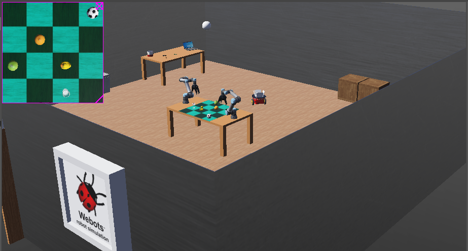
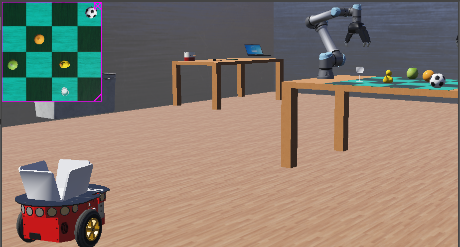
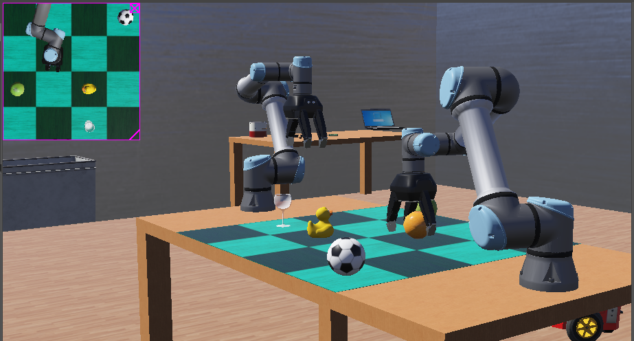

# Simulating Industry 4.0 for the Study of Human-Robot Collaboration
A heterogeneous environment where robots of different types collaborate with humans is simulated using Webots.
Through the simulation of the industrial environment, productive ways can be deduced for deployment of intelligent robots in the local industry. 
The scope includes sensors and perception, actuators and actions, maintaining team and task states.
The project incorporates an easy-to-setup, cost-effective and convenient simulation of human-robot collaboration on the industrial floor, which can later be deployed on-field. 

## Scenario Tested
Suppose a heterogeneous environment, where humans and robots are working together.
The human operator is in need of a tool and asks the robots to fetch it.
The robots then collaborate to deliver the requested object to the human. 

The requested object is first identified, and if it present, it is picked up by a UR5e manipulator/arm robot. The arm which is closer to the identified object picks it up.

